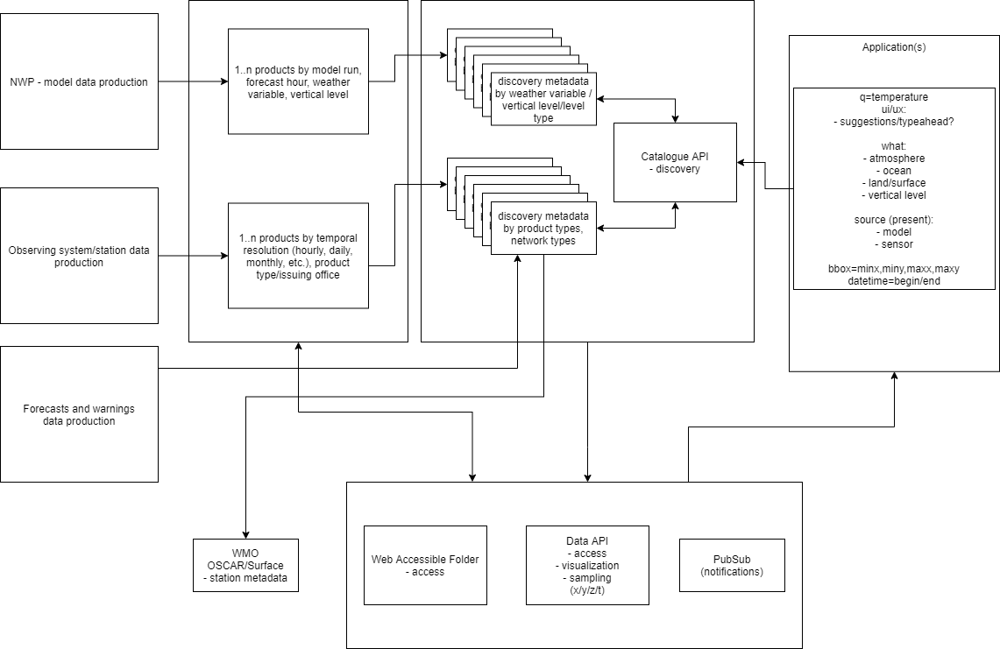

== Architecture

=== Considerations

Given the WIS 2.0 principles, requirements, standards and current design patterns, the following
describes envisioned workflows of WIS 2.0 in the context of metadata search and harvesting.

We consider the following:

* flexible metadata publishing mechanisms: providers need to be able to publish discovery metadata
  in the easiest and most efficient way possible
  * basic, HTTPS crawlable metadata files (filesystem, object storage).  For example, publishing
    discovery metadata as JSON files to an S3 bucket, and then making that bucket available for
    harvesting and traversal to search engines and metadata harvesters
* the browser as the catalogue: here, browsers utilize mass market search engines as the gateway
  to low barrier discovery.  This pattern works without a dedicated WIS catalogue per se, and also
  means discovery metadata would not need to be duplicated/harvested across each GISC, with the idea
  that search engines will harvest from the closest point to the authoritative source
* the canonical WIS catalogue: given WIS 2.0 will not (and should not!) control or enforce search
  engine behaviour, there is a need to provide a resource discovery experience without the various
  intricacies or "value add" typically provided by search engines.  Hence a canonical WIS 2.0
  Catalogue will be recognized by WMO, approved by permanent representatives (PRs).  The canonical
  WIS 2.0 Catalogue would provide a search API and metadata encodings consistent with the standards
  described in <<Standards>>, and thereby can equally be harvested by search engines just the same.

The main difference between the above options is whether providers publish descriptions of resources
via basic methods or APIs.

In either option, providing HTML will facilitate search engine integration, while lower level encodings/formats
will facilitate machine to machine workflow.  In addition, either option will be required for NCs and
DCPCs to publish their discvovery metadata for GISCs to harvest into the canonical WIS Catalogue.

==== Resource-oriented architecture

In alignment with RESTful patterns, it is important to note that data is the "first class citizen".
Operations on the data (e.g. services/APIs) are secondary. Following standards-based practices (such
as the OGC API efforts), metadata records about data will reference services related to those data.
In this approach, the user first finds the data they are interested in, then can bind to those services
via the associated link relations.

==== Data granularity

In order to provide a WIS 2.0 catalogue of value, it is important to clarify the granularity levels
of which providers are to provide metadata.  Clarifying granularity will reduce catalogue "pollution"
and bring the user closer to the data they are looking for, as well as clarify the appropriate
metadata standard to implement for the provider.

* discovery metadata: OARec record model / STAC
* station metadata: WIGOS Metadata Standard
* observation metadata: OGC O&M

The <<metadata-discovery-workflow>> below illustrates example metadata publiciation and discovery workflows against
common meteorological data types:

[[metadata-discovery-workflow]]
.Discovery metadata workflow

* collection (model): NWP model (OARec record metadata).  Example: Canada GDPS
** collection (variable): NWP model output by forecast variable (including vertical levels) (OARec record metadata).  Example: Canada GDPS air temperature
** product options:
*** API endpoint to interrogate the data/variable
*** x/y/z/t (granule) (STAC Item with link to actual data asset)

* collection (observations): surface weather observations (OARec record metadata)
** station metadata as WIGOS metadata via WMO OSCAR/Surface
** product options:
*** API endpoint to interrogate the data
*** x/y/z/t (granule) (STAC Item, with link to actual data asset)

* collection (product): METAR
** product options:
*** API endpoint to interrogate the data
*** product: single message (granule) (STAC Item with link to actual data asset)

GISC catalogues can harvest from DCPCs and/or with the following options:

* harvest all metadata with clear data type identification
* harvest only discovery metadata

==== Publication

Discovery metadata publishing can be provided via two approaches: a static catalogue or
API provisioning.  In both cases, the metadata model and content are identical, but the
means to access and interrogate the metadata vary as described below.

===== Static catalogue publication

* provide discovery metadata as basic, HTTPS crawelable metadata files (filesystem, object
  storage).  For example, publishing discovery metadata as JSON files to an S3 bucket, and
  then making that bucket available for harvesting and traversal to search engines and
  metadata harvesters
* optionally provide lower granularity metadata (i.e. products) in JSON for traversal
* optionally augment all metadata by providing alternate representations in HTML with SEO constructs
  such as schema.org footnote:[https://schemas.org] and/or JSON-LD footnote:[https://json-ld.org]
* register a basic catalogue landing page to GISC for harvest/ingest

===== API provisioning

* provide discovery metadata in JSON
* make discovery metadata available via search API, providing predicates on which to query and
 filter metadata collections
* register API landing page to GISC for harvest/ingest

==== GISC harvesting (aggregation)

In either case, GISCs could support push or pull mechanisms for metadata ingest/harvesting:

1. pull: traversing the catalogue or API resources and ingest metadata into the GISC local catalogue
2. push: subscribe to a given NC/DCPC for notifications of resource updates

We also have to consider harvesting depth (hops) as an option for providers to specify when registering
their resource catalogues to a GISC.

The primary means of GISC harvesting would be via OARec (API) or basic catalogue crawling.  A third option
is possible subject to locally agreed upon arrangements between providers and GISCs.

==== Search

GISCs will provide an OARec endpoint to enable users to search all content provided by the local GISC or
content from other GISCs.  The aggregation will facilitate a fulsome search of all WIS 2.0 resources as
harvested by/between given GISCs.

There is another option to consider: distributed search.  Here, metadata stays with each relevant GISC
and search requests perform realtime searches against remote GISCs.  While this results in simplified
metadata management, it also presents issues concerning network latency/failure, as well as providing
meaningful sets of search results (each GISC would potentially have various relevance algorithms depending
on their Catalogue tooling or backend database or document store).  This requires further discussion.

==== Standards implementation approach

